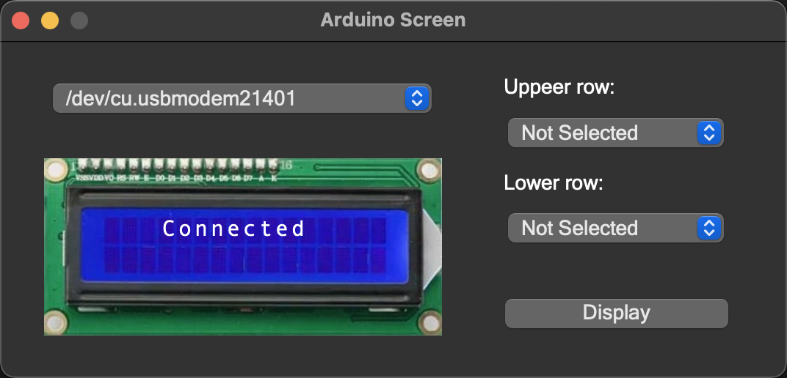

<a id="readme-top"></a>


<!-- PROJECT SHIELDS -->
[![MIT License][license-shield]][license-url]


<!-- PROJECT LOGO -->
<br />
<div align="center">
  <a href="https://github.com/w3rr0/Arduino-screen">
    
  </a>

  <h3 align="center">Arduino Screen</h3>

  <p align="center">
    A window application to control the Arduino screen
    <br />
    <a href="https://github.com/w3rr0/Arduino-screen/issues/new?labels=bug&template=bug-report---.md">Report Bug</a>
    &middot;
    <a href="https://github.com/w3rr0/Arduino-screen/issues/new?labels=enhancement&template=feature-request---.md">Request Feature</a>
  </p>
</div>


<!-- TABLE OF CONTENTS -->
<details>
  <summary>Table of Contents</summary>
  <ol>
    <li>
      <a href="#about-the-project">About The Project</a>
      <ul>
        <li><a href="#built-with">Built With</a></li>
      </ul>
    </li>
    <li>
      <a href="#getting-started">Getting Started</a>
      <ul>
        <li><a href="#prerequisites">Prerequisites</a></li>
        <li><a href="#installation">Installation</a></li>
      </ul>
    </li>
    <li><a href="#usage">Usage</a></li>
    <li><a href="#contributing">Contributing</a></li>
    <li><a href="#license">License</a></li>
    <li><a href="#contact">Contact</a></li>
  </ol>
</details>


<!-- ABOUT THE PROJECT -->
## About The Project





A windowed application that allows you to display the most useful information on the Arduino screen when your main displays are occupied with other things.
The compact size of this screen allows you to place it in the most convenient location, such as under the monitor or above the keyboard.
You decide what information to display, and you can change it whenever you need it.

Options that can be displayed:
- Time
- Date
- Weather
- RAM Usage
- RAM Available
- CPU Usage
- Network

<p align="right">(<a href="#readme-top">back to top</a>)</p>


### Built With

The following tools were used to build the application:
- Aplikacja okienkowa:
  - Qt for Python (PySide 6)
  - Qt Creator (UI)
- Program na arduino:
  - .ino (C++)


<p align="right">(<a href="#readme-top">back to top</a>)</p>


<!-- GETTING STARTED -->
## Getting Started

To get started, you'll need the appropriate version of Python, the necessary dependencies, and an Arduino coding program installed.
I also recommend Qt Creator as an IDE and Qt Designer for UI development, but they're not essential.

### Prerequisites

Before you start working, connect the I2C LCD display (2x16) to the Arduino and then the whole thing via a USB cable to the computer.

Install Arduino IDE from the [official website](https://www.arduino.cc/en/software).
Then use it to upload [arduino-screen.ino](http://www.github.com/w3rr0/Arduino-screen/arduino-screen.ino) to your arduino.

### Installation

* python 3.9.6
  ```sh
  python3.9 --version
  ```
  If you don't have this version, install it.
* project files
  ```sh
  git clone https://github.com/w3rr0/Arduino-screen.git
  cd Arduino-screen
  ```
* virtual environment
  ```sh
  python3.9 -m venv .venv
  ```
  * Linux/Mac
    ```sh
    source .venv/bin/activate
    ```
  * Windows (cmd)
    ```sh
    .venv\Scripts\activate
    ```
  * Windows (PowerShell)
    ```sh
    .\.venv\Scripts\Activate.ps1
    ```
* requirements
  ```sh
  pip install -r requirements.txt
  ```

<p align="right">(<a href="#readme-top">back to top</a>)</p>


<!-- USAGE EXAMPLES -->
## Usage

You can run the program from Qt Creator (green play icon) or simply run the widget.py file in Python.

First, you select a device from the list of available ports, select the information you want to display, and click Display.
Your Arduino screen should now show the content you selected.

<p align="right">(<a href="#readme-top">back to top</a>)</p>


<!-- CONTRIBUTING -->
## Contributing

If you have a suggestion that would make this better, please fork the repo and create a pull request.
You can also simply open an issue with the tag "enhancement".

1. Fork the Project
2. Create your Feature Branch (`git checkout -b main/NewFeature`)
3. Commit your Changes (`git commit -m 'Add NewFeature'`)
4. Push to the Branch (`git push origin main/NewFeature`)
5. Open a Pull Request

<p align="right">(<a href="#readme-top">back to top</a>)</p>


<!-- LICENSE -->
## License

Distributed under the MIT License. See `LICENSE.txt` for more information.

<p align="right">(<a href="#readme-top">back to top</a>)</p>


<!-- CONTACT -->
## Contact

Konrad Mateja - konradmateja65@gmail.com

Project Link: [https://github.com/w3rr0/Arduino-screen](https://github.com/w3rr0/Arduino-screen)

<p align="right">(<a href="#readme-top">back to top</a>)</p>


<!-- MARKDOWN LINKS & IMAGES -->
<!-- https://www.markdownguide.org/basic-syntax/#reference-style-links -->
[license-shield]: https://img.shields.io/github/license/w3rr0/Arduino-screen.svg?style=for-the-badge
[license-url]: https://github.com/w3rr0/Arduino-screen/LICENSE.txt
